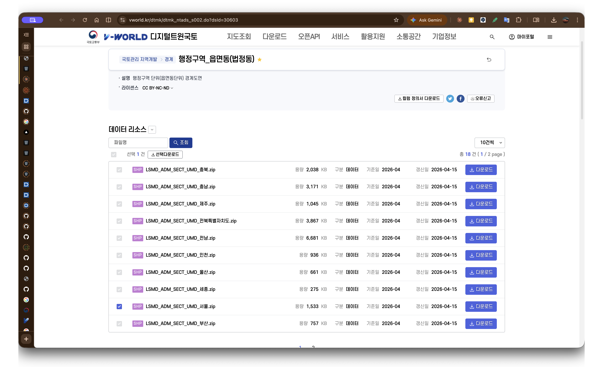

# TIL: V-World LSMD shapefile 함정 3종 — 데이터셋 종류·EUC-KR·EMD_CD 8자리

날짜: 2026-05-05

## 다운로드 경로

V-World → `데이터` → `다운로드` → 카테고리 `국토관리/지역개발 > 경계` → **`행정구역_읍면동(법정동)`** (`LSMD_ADM_SECT_UMD`).
시도별 SHP zip이 18개 항목으로 분리 — `LSMD_ADM_SECT_UMD_서울.zip` (1.5 MB) 하나만 받으면 된다.



데이터셋 페이지: `vworld.kr/dtmk/dtmk_ntads_s002.do?dsId=30603` · 라이선스 CC BY-NC-ND · 갱신일 2026-04-15.

## 현상

ADR-008(법정동 폴리곤 마이그레이션) 실행 단계에서 V-World 다운로드 → `load_polygon.py` 적재 → MV REFRESH로 갈 때 세 군데서 막혔다.

1. 첫 다운로드 (`LSMD_CONT_LDREG_서울`, 200MB, 899,435행) → `법정동명 컬럼을 찾을 수 없음. 컬럼 목록: ['SGG_OID','JIBUN','BCHK','PNU','COL_ADM_SE','geometry']`
2. 올바른 파일(`LSMD_ADM_SECT_UMD_서울`, 2.4MB, 467행) → "서울 필터 후: 0행"
3. 인코딩 문제: 한글 동 이름이 `±ÃÁ¤µ¿`처럼 깨져서 출력

## 원인

V-World의 LSMD(Land Survey Map Data) 데이터셋은 종류가 여러 개고, 컬럼 스키마와 인코딩이 다 다르다.

### 1) `LSMD_CONT_LDREG` ≠ 법정동경계

| 데이터셋 | 의미 | 단위 | 행 수(서울) | 우리 용도 |
|---|---|---|---|---|
| `LSMD_CONT_LDREG_11` | **연속지적도** | 필지(parcel) | ≈90만 | ❌ 너무 세밀, 동명 컬럼 없음 |
| **`LSMD_ADM_SECT_UMD_11`** | **법정 읍면동 경계** | 동 | 467 | ✅ 정답 |
| `LSMD_ADM_SECT_RI_11` | 법정 리 | 리 | (서울 거의 없음) | - |
| `LSMD_ADM_SECT_SGG_11` | 시군구 | 구 | 25 | - |

`LSMD_CONT_LDREG`는 토지대장의 필지 단위. `PNU`(필지일련번호 19자리, 앞 10자리가 법정동코드)만 있고 동명은 없다. 동 단위 폴리곤을 얻으려면 PNU 앞 10자리로 dissolve 필요(수 분 처리, 별도 매핑 테이블 필요) — 비효율.

### 2) `EMD_CD`는 8자리

`LSMD_ADM_SECT_UMD`의 코드 컬럼 `EMD_CD`는 **8자리** (시도2 + 시군구3 + 읍면동3, 예: `11110103`). RTMS API가 사용하는 법정동 코드는 **10자리** (`1111010300`, 끝 2자리는 "리" 자리).

| 컬럼/소스 | 길이 | 예시 |
|---|---|---|
| RTMS `법정동시군구코드+법정동읍면동코드` | 10 | `1111010300` |
| LSMD UMD `EMD_CD` | 8 | `11110103` |

기존 `load_polygon.py`는 `zfill(10)`(앞에 "0" 패딩)으로 처리해서 `0011110103`이 돼버렸고, `startswith("11")` 서울 필터에 0건 통과.

### 3) `.cst` 파일 인코딩 EUC-KR

V-World shapefile은 인코딩 표시를 `.cpg`(geopandas 인식)가 아닌 `.cst`(인식 안 함)로 둔다. 명시적으로 `encoding='euc-kr'` 안 주면 시스템 기본(UTF-8)으로 잘못 디코딩 → `궁정동 → ±ÃÁ¤µ¿`.

## 수정

`db/load_polygon.py`에 함수 두 개 추가:

```python
def detect_shapefile_encoding(path: str) -> str | None:
    """같은 디렉토리의 .cpg/.cst 파일에서 인코딩 추출."""
    base = path.rsplit(".", 1)[0]
    for ext in (".cpg", ".cst"):
        sidecar = base + ext
        if os.path.exists(sidecar):
            with open(sidecar, "r", encoding="ascii") as f:
                enc = f.read().strip()
                if enc:
                    return enc
    return None


def pad_bjd_code_to_10(value: object) -> str:
    """8자리 EMD_CD(시도2+시군구3+읍면동3) → 10자리 법정동 코드(끝에 "리" 자리 "00")."""
    s = str(value).strip()
    if len(s) == 8:
        return s + "00"
    return s.zfill(10)
```

`gpd.read_file(path, encoding=detect_shapefile_encoding(path) or 'utf-8')`로 인코딩 명시 + `pad_bjd_code_to_10` 호출 위치 두 군데 교체.

검증: `bjd_polygon` 467개 법정동 적재 → `mv_dong_stats × bjd_polygon` JOIN: TRADE 390/390, JEONSE 411/411 (100% 매칭). Phase 0에서 확인했던 강북권 후보(방학동 5.0억, 쌍문동 5.4억) 정상 노출.

## 교훈

- V-World LSMD 데이터셋 골라내기:
  - 동/리 단위 색칠 지도 = `LSMD_ADM_SECT_UMD` 또는 `_RI`
  - `LSMD_CONT_LDREG`는 필지 단위 — 행정구역 색칠에 부적합
- 한국 공공 데이터 코드 길이 함정: 시도2 + 시군구3 + 읍면동3 + 리2 = 10자리 표준이지만, 데이터셋마다 마지막 "리" 두 자리가 잘리거나 따로 컬럼으로 분리됨. **무조건 zfill 말고 길이 분기 후 패딩**.
- shapefile 인코딩은 `.cpg` 표준이지만 V-World는 `.cst`로 둘 때 있음 → 둘 다 폴백 탐지. EUC-KR/CP949가 한국 데이터 기본값.
- 외부 데이터 적재 전에 **무조건 dry-run + 컬럼·길이·샘플값 출력**. 한 번에 적재하면 같은 함정 여러 개 한꺼번에 만남.
